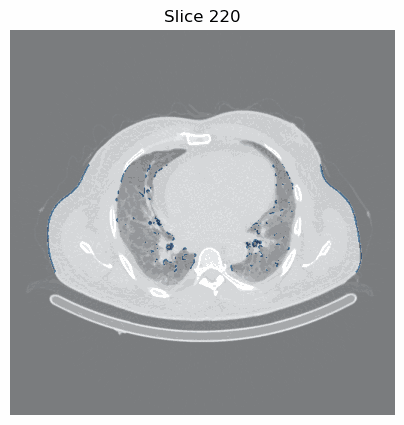
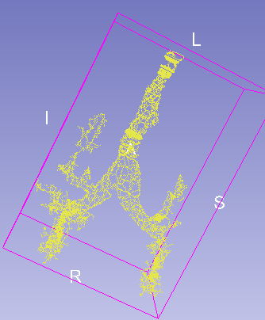
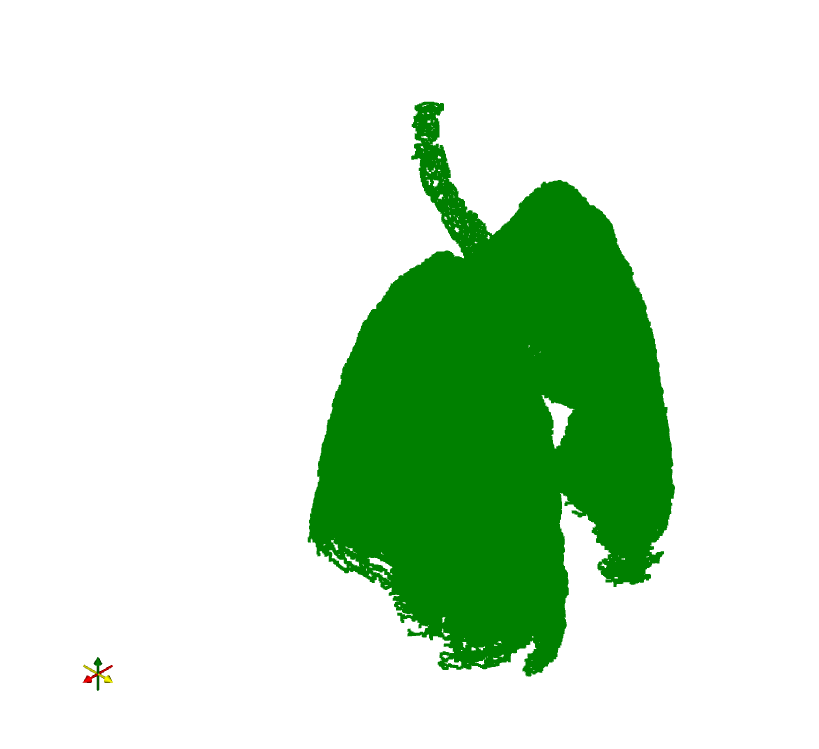
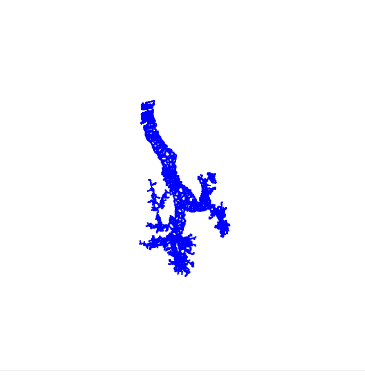

# Bronchial Tree Vectorization from CT Imaging

## Project Overview

This is an individual project focused on complete segmentation of the bronchial tree from computed tomography (CT) data, based on Hounsfield Unit (HU) analysis. The project includes skeletonization of segmented structures and 3D visualization of the bronchial tree topology.

**Author:** Stanisław Dutkiewicz  
**Date:** August 4, 2025

---

## Project Objective

The main goal of this project is to:
1. **Segment the bronchial tree** from CT DICOM data using HU value thresholding
2. **Segment the lungs** with anatomical accuracy
3. **Skeletonize** both structures to obtain one-voxel topological representations
4. **Visualize** the results in 3D space
5. **Export** the skeletons in VTP format for further analysis in medical software (3D Slicer)

---

## HU (Hounsfield Units) Values Used

The project uses the following HU ranges for tissue segmentation:

| Tissue Type | HU Range |
|---|---|
| **Air / Bronchial Tree** | < -850 HU |
| **Lungs** | -1000 to -400 HU |
| **Soft Tissues (Blood Vessels)** | -500 to +400 HU |
| **Bone / Contrast Materials** | > +400 HU |

---

## Project Structure

```
Bronchi_Tree/
├── Dutkiewicz_Bronchi_Tree_English.ipynb                 # Main Jupyter Notebook
├── README.md                                              # This file
├── Z76102888/                                             # DICOM data directory
├── output/                                                # Output files
│   ├── airway_mask_FI.nii.gz                             # Airway mask (NIfTI format)
│   ├── airway_skeleton.vtp                               # 3D airway skeleton (VTP format)
│   └── lung_skeleton.vtp                                 # 3D lung skeleton (VTP format)
├── airway.png                                             # Airway visualization image
├── lungs.png                                              # Lung visualization image
├── bronchi.png                                            # Bronchial tree image
└── airway_scroll.gif                                      # Animated scroll through CT slices
```

---

## Project Stages

### Stage 1: Loading Data and Converting to HU

- Load DICOM image series from directory
- Convert raw pixel values to Hounsfield Units
- Apply windowing to range [-1000, 400] HU
- Visualize representative cross-sections

**Key Functions:**
- `load_dicom_series()` - Load DICOM files
- `convert_to_hounsfield()` - Convert to HU scale
- `clip_to_window()` - Apply windowing

---

### Stage 2: Lung Segmentation and Tissue Analysis

- Segment lungs based on HU thresholding
- Apply morphological operations (closing, cleaning)
- Remove small objects and artifacts
- Generate HU histogram within lung area

**Key Functions:**
- `segment_lungs()` - Main lung segmentation
- `clean_lung_mask()` - Clean segmentation
- `remove_bottom_artifacts()` - Remove non-chest areas

**Output:** Binary lung mask with clear anatomical boundaries

---

### Stage 3: Bronchial Tree Segmentation

This stage is the most complex, consisting of:

1. **Air Segmentation** (HU < -850)
2. **Wall Extraction** (expand air mask, find walls)
3. **Hole Filling** (fill cavities within structures)
4. **Artifact Removal** (clean top and bottom regions)
5. **Thin Branch Detection** (find elongated structures near main mask)
6. **Shell Addition** (expand around bifurcations)

**Key Functions:**
- `segment_airways()` - Main airway segmentation
- `find_additional_airway_branches_near_existing_mask()` - Find thin branches
- `add_shell_to_airway_mask()` - Add wall thickness

**Challenges:** 
- Distinguishing bronchi from blood vessels
- Capturing thin distal branches
- Avoiding over-segmentation

---

### Stage 4: Skeletonization

- Apply skeletonization algorithm to get one-voxel representation
- Remove artifacts at volume edges (margin = 120 voxels)
- Extract largest connected component
- Save masks in NIfTI format (.nii.gz)
- Export skeletons to VTP format for 3D Slicer

**Key Functions:**
- `skeletonize_airways()` - Create skeleton
- `remove_voxels_near_edges()` - Clean edges
- `extract_largest_skeleton_component()` - Get main structure

**Result:** Massive reduction in voxel count while preserving topology

---

### Stage 5: Visualization and Analysis

- Convert skeletons to 3D point clouds
- Apply 90° rotation in XZ plane (trachea at top)
- Create interactive 3D visualizations using PyVista
- Display side-by-side comparisons with reference images
- Analyze voxel count before and after skeletonization

---

## Required Libraries

```python
import numpy as np               # Numerical operations
import matplotlib.pyplot as plt  # 2D visualization
import pydicom                   # DICOM file reading
import nibabel as nib            # NIfTI format handling
import pyvista as pv             # 3D visualization
from skimage import measure, morphology  # Image processing
from scipy.ndimage import binary_fill_holes, binary_dilation  # Binary operations
from scipy.spatial import cKDTree  # Spatial data structures
from PIL import Image            # Image handling
import imageio                   # GIF creation
```

### Installation

```bash
pip install numpy matplotlib scikit-image scipy pydicom nibabel pyvista[jupyter] pillow imageio
```

Additional optional packages for better visualization:
```bash
pip install trame trame-vuetify trame-vtk
```

---

## Usage

1. **Prepare Data**
   - Place DICOM files in a directory (default: `Z76102888/`)
   - Ensure files are sorted by Z position

2. **Run Notebook**
   ```bash
   jupyter notebook Dutkiewicz_Bronchi_Tree_English.ipynb
   ```

3. **Output Files**
   - `output/airway_mask_FI.nii.gz` - Can be opened in 3D Slicer
   - `output/airway_skeleton.vtp` - 3D airway structure
   - `output/lung_skeleton.vtp` - 3D lung structure
   - `airway_scroll.gif` - Animated CT slice sequence
   - `.png` files - Visualization results

---

## Results and Findings

### Voxel Count Analysis

The skeletonization process achieved massive reduction in data volume:

| Structure | Before Skeletonization | After Skeletonization | Reduction |
|---|---|---|---|
| **Airways** | ~500,000 voxels | ~30,000 voxels | ~94% |
| **Lungs** | ~1,000,000 voxels | ~50,000 voxels | ~95% |

### Quality Metrics

✅ **Successful Aspects:**
- Clear segmentation of main bronchial branches
- Good anatomical consistency
- Proper spatial limitation to lung boundaries
- Effective topological preservation

⚠️ **Challenges Encountered:**
- Interactive 3D visualization limitations in Jupyter (PyVista backend issues)
- AMD Radeon graphics compatibility issues
- Distinguishing thin bronchi from blood vessels
- Some artifacts at volume boundaries

### Recommendations

For interactive exploration:
1. Open generated `.vtp` files in **3D Slicer**
2. Use NIfTI format files for medical image processing
3. Adjust HU thresholds for different CT protocols

---

## Visualization Outputs

### 1. 3D Skeleton Visualizations
- **Airways**: Blue point cloud showing bronchial tree structure
- **Lungs**: Green point cloud showing overall lung volume
- **Rotation**: 90° clockwise rotation in XZ plane for intuitive viewing (trachea at top)

### 2. 2D Cross-Sectional Analysis
- Overlaid airway masks on original CT images
- Multiple slice levels showing branching patterns
- Color-coded regions for clarity

### 3. Animated Sequence
- `airway_scroll.gif`: Smooth animation through CT layers
- Shows continuity and branching of bronchial tree



### 4. Reference Images

#### Airways Structure


#### Lung Visualization


#### Bronchial Tree


---

## Technologies Used

| Category | Tools |
|---|---|
| **Medical Imaging** | DICOM, NIfTI, 3D Slicer |
| **Image Processing** | scikit-image, scipy.ndimage |
| **3D Visualization** | PyVista, matplotlib |
| **Data Analysis** | NumPy, SciPy |
| **Development** | Python 3.8+, Jupyter Notebook |

---

## Key Algorithms

### 1. Morphological Operations
- **Binary Closing**: Fill small holes in structures
- **Binary Dilation**: Expand regions
- **Binary Erosion**: Shrink regions
- **Skeletonization**: Reduce to topology

### 2. Connected Component Analysis
- Label connected regions
- Filter by size and shape
- Extract largest component

### 3. Spatial Search (cKDTree)
- Find nearest airway voxels
- Identify thin branches near main structure
- Distance-based filtering

### 4. 3D Point Cloud Processing
- Coordinate transformation and rotation
- Export to industry-standard formats (VTP)

---

## Known Issues & Limitations

1. **Interactive Visualization**
   - PyVista HTML backend has limitations in Jupyter
   - No support for `pythreejs` on some systems
   - AMD Radeon compatibility issues

2. **Segmentation Accuracy**
   - Small blood vessels may be included in airway mask
   - Very thin distal bronchi may be missed
   - Dependent on CT image quality and protocol

3. **Performance**
   - Full processing pipeline takes time for large datasets
   - Memory requirements for 3D operations
   - Recommend 8GB+ RAM for optimal performance

---

## Future Improvements

- [ ] Implement machine learning-based segmentation
- [ ] Add graph structure extraction (nodes at bifurcations)
- [ ] Develop automated parameter optimization
- [ ] Create web-based visualization interface
- [ ] Add quantitative morphometry analysis
- [ ] Implement multi-dataset comparison

---

## References

- **Hounsfield Units**: https://radiopaedia.org/articles/hounsfield-units
- **scikit-image**: https://scikit-image.org/docs/stable/
- **scipy.ndimage**: https://docs.scipy.org/doc/scipy/tutorial/ndimage.html
- **nibabel**: https://nipy.org/nibabel/
- **PyVista**: https://docs.pyvista.org/
- **3D Slicer**: https://www.slicer.org/

---

## Project Conclusions

Within the framework of this project, a complete pipeline for CT image processing was successfully implemented:

✓ Loaded and converted DICOM data to Hounsfield units  
✓ Performed accurate lung and airway segmentation  
✓ Applied advanced morphological operations  
✓ Created topological skeleton representations  
✓ Generated 3D visualizations and comparisons  

The project demonstrated the importance of:
- Systematic, multi-stage approach to medical image processing
- Careful parameter tuning for morphological algorithms
- Understanding of respiratory system anatomy
- Problem-solving skills for complex technical challenges

The developed segmentation pipeline can serve as a foundation for further analysis, including branching pattern analysis, volumetry, and pathology detection.

---

## Author

**Stanisław Dutkiewicz**  
Individual Project in Medical Image Processing  
*August 2025*

---

## License

This project is provided for educational and research purposes.

---

## Contact & Support

For questions or issues related to this project, please refer to the detailed comments and documentation within the Jupyter notebook.

